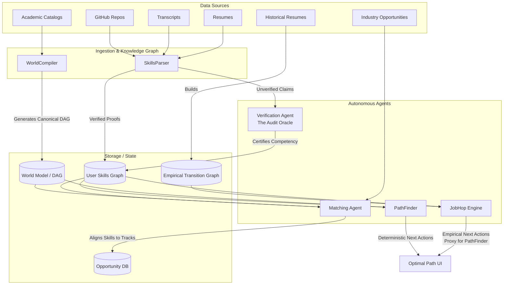

# SpArc AI: Career & Education Architecture Design

> [!NOTE]
> This document outlines the architectural blueprint for the innovative multi-agent educational and career planning system. It defines the core intelligent components, their data models, and the asynchronous orchestration between them.

## 1. High-Level Architecture
The system consists of six major intelligence components (including a statistical proxy engine) working together asynchronously. They form a closed-loop system where data ingested from the real world is compiled into a world model, and users are optimally routed through this world model to reach their goals.

## 2. Component Design Blueprints

### 2.1 SkillsParser: The Ingestion Engine
**Mission**: Extract, disambiguate, and structure latent skills from noisy, unstructured personal data.

*   **Inputs**: OAuth APIs (GitHub, GitLab), PDF uploads (Resumes, Transcripts), LinkedIn exports.
*   **Processing Pipeline**:
    1.  **Extraction**: Utilizes LLMs with structured JSON outputs to extract entities (Tools, Languages, Frameworks, Soft Skills, Coursework).
    2.  **Semantic Mapping**: Maps extracted keywords to a canonical taxonomy (e.g., standardizing "React.js" and "React18" to canonical `skill:react`).
    3.  **Graph Generation**: Constructs the initial User Skills Graph consisting of "claimed" edges.
*   **Outputs**: A multi-dimensional User Skills Graph mapping verified proofs versus unverified claims.

### 2.2 WorldCompiler: The Institutional Reasoning Engine
**Mission**: Translate fragmented academic and institutional rules into a universal, machine-readable knowledge graph.

*   **Inputs**: University course catalogs, certification requirements, syllabus PDFs.
*   **Data Structure**: A canonical Directed Acyclic Graph (DAG) representing the "World Model".
    *   **Nodes**: Courses, Certifications, Degrees, Canonical Skills.
    *   **Edges**: `REQUIRES`, `COREQUISITE`, `EQUIVALENT_TO`, `AWARDS_SKILL`.
*   **Processing Logic**:
    1.  **Syllabus Parsing**: Identifies prerequisites, corequisites, and learning outcomes natively through NLP.
    2.  **Equivalency Mapping**: Uses LLM embedding similarity to cluster essentially equivalent courses across institutions.
    3.  **Constraint Normalization**: Resolves credit hours and complex logical constraints (e.g., "(Course A OR Course B) AND Course C").
*   **Outputs**: The definitive World Model utilized by PathFinder for graph traversal.

### 2.3 PathFinder: The Backward-Chaining Algorithm
**Mission**: Calculate the optimal trajectory from a user's current verified state to an arbitrary target state.

*   **Inputs**: User's current verified Skills Graph, target Terminal Node (e.g., "Senior ML Engineer"), and real-time resource constraints (Time/Budget).
*   **Algorithm (A* Over Graph)**:
    1.  Starts at the terminal node in the World Model DAG.
    2.  Recursively walks backward through prerequisites, expanding required branches.
    3.  Terminates branches when encountering a node already saturated in the User Skills Graph.
    4.  **Cost Function Optimization**: Weights edges based on time-to-complete, cost, or difficulty to find the critical path for "speed-running" degrees.
*   **Outputs**: A sequenced, actionable plan detailing the lowest-drag route to the objective.

**Statistical Approximation: The JobHop Engine**
One way to approximate this step before the complete WorldCompiler is built is to use a statistical proxy. It finds optimal career paths based on empirical transition probabilities (how frequently people move from Job A to Job B in the real world).

*   **Inputs**: Large-scale dataset of real-world resumes (e.g., hundreds of thousands of career histories), user's current role or skill state, and target role.
*   **Data Structure**: An Empirical Transition Graph mapping roles to roles, weighted by the frequency/probability of transitions observed in the wild.
*   **Processing Logic**:
    1.  **Graph Construction**: Parses historical resume data to build an adjacency list of career moves.
    2.  **Probability Weighting**: Edges are weighted using `-log(probability)` to allow for shortest-path algorithms to maximize transition likelihood.
    3.  **Graph Traversal**: Uses modified Dijkstra or A* search to uncover the most likely paths from the current state to the target state.
*   **Outputs**: Probable, historically validated career trajectories bridging the gap between current and target roles.

## 3. Training Data & Fine-Tuning Requirements

To achieve production scale and accuracy, several components require offline training pipelines and dataset curation:

### 3.1 Where Training Data is Required

*   **Statistical Proxy (JobHop Engine)**:
    *   **Data Source**: Large-scale resume datasets (e.g., JobHop, O*NET, Lightcast, LinkedIn datasets) combined with Bureau of Labor Statistics data.
    *   **Usage**: Required to build the Empirical Transition Graph. We need to calculate the transition frequency $P(Role B | Role A)$ to accurately weight the edges between nodes. This is a continuous offline pipeline, not an LLM application.
*   **Knowledge Graph (WorldCompiler)**:
    *   **Data Source**: O*NET database files (for canonicalizing skill taxonomies and job descriptions), university syllabi, and certification rubrics.
    *   **Usage**: Used to define the "Golden Taxonomy" of skills. Raw strings extracted from resumes ("React18", "react.js") must map to the canonical O*NET node for "React".

### 3.2 Fine-Tuning vs. Zero-Shot Models

Most agents in the system will operate using state-of-the-art generalist models (e.g., GPT-4o, Claude 3.5 Sonnet) via **Few-Shot Prompting**, but specific tasks require fine-tuning to improve speed, cost, and accuracy:

*   **SkillsParser (Requires Fine-Tuning)**:
    *   **Why**: Extracting complex entities (skills, tools, seniority levels) from highly chaotic resumes (PDFs with bad formatting) is notoriously difficult for zero-shot models.
    *   **Action**: Fine-tune a smaller, faster model (e.g., Llama 3 8B or GPT-3.5) on a dataset of 10,000+ manually-labeled resumes to consistently output precise JSON schema vectors matching the O*NET canonical taxonomy.
*   **Verification Agent (Requires Fine-Tuning)**:
    *   **Why**: Evaluating architectural code quality requires highly specific domain knowledge that aligns with *your* company's specific definition of "good code."
    *   **Action**: Fine-tune an LLM on pairs of `[Raw Artifact] -> [Evaluation Rubric & Score]`. The training data would be high-quality code reviews, PR comments from senior engineers on open source projects, and explicitly curated "Golden Path" vs "Anti-Pattern" code examples.
*   **Matching Agent & PathFinder (No Fine-Tuning Needed)**:
    *   These components do not require fine-tuning. The PathFinder is a deterministic graph algorithm (A* or Dijkstra), while the Matching Agent relies on vector mathematics (Cosine Similarity) or simple LLM reasoning over the structured output of the other engines.
### 2.4 Matching Agent: The Orchestration Layer
**Mission**: Perform multi-dimensional gap analysis to connect users to immediate industry or academic opportunities.

*   **Execution Trigger**: Event-driven on state changes to the User Skills Graph.
*   **Seven Dimensions of Gap Analysis**:
    1.  Technical Hard Skills
    2.  Domain Knowledge
    3.  Execution Capability (Verified portfolio complexity)
    4.  Tooling & Environments
    5.  Seniority/Scale Context
    6.  Soft Skills / Collaboration
    7.  Velocity (Pacing of learning)
*   **Feedback Loop**: Dynamically recalculates cosine similarity vectors as the user adds new proof-of-work, serving high-match opportunities in real time.

### 2.5 Verification Agent (The Audit Oracle)
**Mission**: Autonomously grade and certify technical artifacts to convert "claimed" skills into "verified" competencies in the User Skills Graph.

*   **Inputs**: Raw artifacts (GitHub repo links, PR diffs, Jupyter notebooks).
*   **Processing Pipeline**:
    1.  **Static Analysis (The Baseline)**: Clones the repository, executes AST parsers, checks linting, test coverage, and cyclomatic complexity using standard tools (e.g., SonarQube, ESLint). This establishes the raw metrics.
    2.  **Dynamic Review (The Agentic Layer)**: Employs an LLM to evaluate architectural choices, code elegance, and trade-off reasoning.
        *   *Ground Truth for Dynamic Review*: The agent evaluates against parsed "golden path" reference architectures, verified high-quality open-source codebases (e.g., React source code, Linux kernel), and established professional rubrics (e.g., SOLID principles, OWASP top 10) ingested during the systemic planning phase.
        *   *Why an Agent is Needed*: While standard CI/CD tools can calculate cyclomatic complexity, they cannot assess if a complex piece of code was *necessary* for the specific domain problem, whether the system design handles edge cases gracefully, or if the developer successfully implemented a novel design pattern. The agent provides human-like contextual reasoning on *why* the code was written a certain way, determining true competency rather than just syntax correctness.
    3.  **Proof-of-Work Hashing**: Generates an immutable hash of the evaluated artifact coupled with the agent's reasoning chain.
*   **Outputs**: Upgrades user claims to verified edges, attaching a confidence score (e.g., `Verified React Mastery: Level Intermediate (92%)`).

